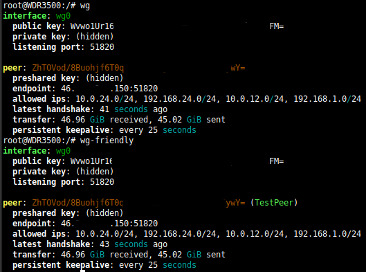

# OpenWRT Wireguard friendly cli peernames

Many thanks to [ppmm](https://forum.openwrt.org/t/wireguard-friendly-peernames-on-cli/250011) from the OpenWRT forum for the inital idea.  

# Install
To use the script create a file on your OpenWRT device in /usr/bin/ called wg-friendly.  

> vi /usr/bin/wg-friendly

Copy the script content into the file and 
make it executable with  

>  chmod +x wg-friendly

Now the script can executed from everywhere with  
>  wg-friendly

It will show the output of wg with the enhancement of the friendly peer names greped from the network config.  
He is an example of the output of wg va wg-friendly.  

